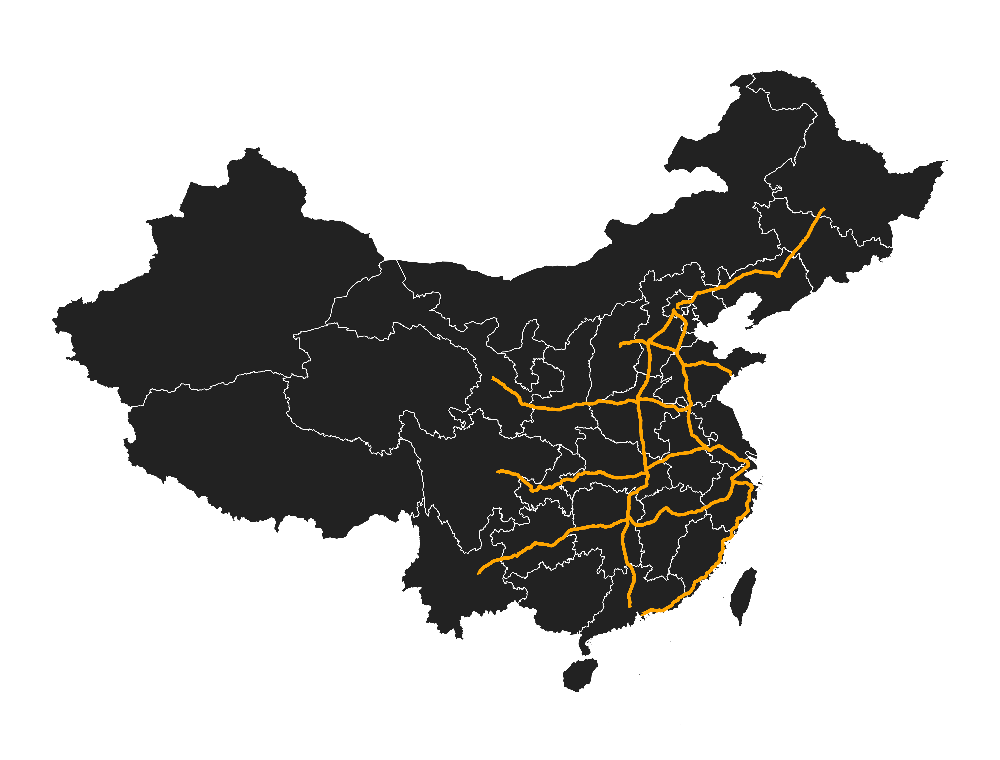

# 🚄 火车线路轨迹可视化 | Railway KML Visualizer
本项目用于将多个铁路轨迹的 KML 文件可视化为交互式地图。

主要包含两个功能模块：
- 基于 Folium 的 HTML 地图交互可视化；
- 基于 GeoPandas + Matplotlib 的静态图片地图导出。

### 功能特性
- 读取多个 KML 文件，提取其中 LineString 坐标，生成线路图；
- 使用 Folium 创建交互式地图，及通过 Matplotlib 生成图片；
- 支持多种线路颜色调节；
- 支持多种底图切换；
- 提供线路信息提示。
---

```bash
.
├── visualization_web.py         # 交互式地图
├── visualization_pic.py         # 静态图绘制
├── background.json              # 底图
├── *.kml                        # 轨迹文件
├── railway_trace_map.html       # 输出的交互地图
├── railway_trace_map.png        # 输出的静态地图
├── requirements.txt             # 项目依赖
└── README.md                    # 项目说明文件
```

---


### 获取铁路轨迹 KML 步骤
每一次的铁路出行往往对应着多条铁路运行线路，比如G55次列车（北京西-西安北）的行驶路线就包括京广高铁（北京-郑州）以及徐兰高铁（郑州-西安），如何通过一张火车票获得铁路运行路径请点击[这里](https://mp.weixin.qq.com/s/2M-nhI65xb3S9UnIZBXoOA "这里")（如果点击链接无法进入请复制链接至浏览器中打开 https://mp.weixin.qq.com/s/2M-nhI65xb3S9UnIZBXoOA ）。

如果你已经对国铁列车运行路径很熟悉的话，直接点击[这里](https://fog.vicc.wang/rails "这里")获取运行线路KML文件（如果点击链接无法进入请复制链接至浏览器中打开 https://fog.vicc.wang/rails ）, 下载好的文件请直接放到本项目根目录，网页使用步骤如下：
- 选择途径、起始站点（如北京南）
- 选择对应线路（如京沪高铁）
- 选择始发终到站（如北京南-济南西）
- 点击导出KML

若要通 GeoPandas + Matplotlib 导出静态线路图，那么还需要提前准备一张底图 json 文件作为图片展示的背景，我这里选择了[GADM](https://gadm.org/download_country.html "GADM")上的地图。

---

### 环境依赖说明与安装
本项目包含两个主要功能模块：
- 基于 Folium 的 HTML 地图交互可视化；
- 基于 GeoPandas + Matplotlib 的静态图片地图导出。

建议使用 Python 3.7 及以上版本。


#### 所需依赖列表

| 库名称        | 版本建议     | 功能用途                                 |
|---------------|--------------|------------------------------------------|
| `folium`      | >= 0.12.1    | 构建 HTML 交互地图                        |
| `lxml`        | >= 4.6.3     | 解析 KML/XML 文件                         |
| `geopandas`   | >= 0.10.0    | 空间数据处理与绘图（静态图）             |
| `shapely`     | >= 1.7       | 几何对象处理（如 LineString）            |
| `matplotlib`  | >= 3.3       | 生成 PNG 静态地图                        |
| `pyproj`      | >= 3.0       | 坐标系转换支持（GeoPandas 间接依赖）     |
| `fiona`       | >= 1.8       | GeoJSON 文件读取（GeoPandas 间接依赖）   |


> 注意：安装 `geopandas` 时会自动安装大部分空间数据处理依赖（如 `shapely`, `fiona`, `pyproj` 等），建议一次性通过完整方式安装。

#### 安装依赖
进入终端，执行以下命令
如果只生成 html 交互地图：
```bash
pip install folium
pip install lxml
```
如果需要生成静态图片，还需安装
```bash
pip install geopandas
pip install matplotlib
```
> 注意：建议使用 `venv` 或 `conda` 创建虚拟环境，避免污染全局环境。

---

### 交互式地图与静态地图

##### 交互式 HTML
运行 visualization_web.py 会得到一个可交互的 html 文件，支持多种底图切换、多种线路颜色调节、线路粗细调节以及线路信息显示。


##### 静态地图
运行 visualization_pic.py 会得到一个静态 png 文件，如果想要修改底图以及线路，需要去改 python 文件中的代码。


